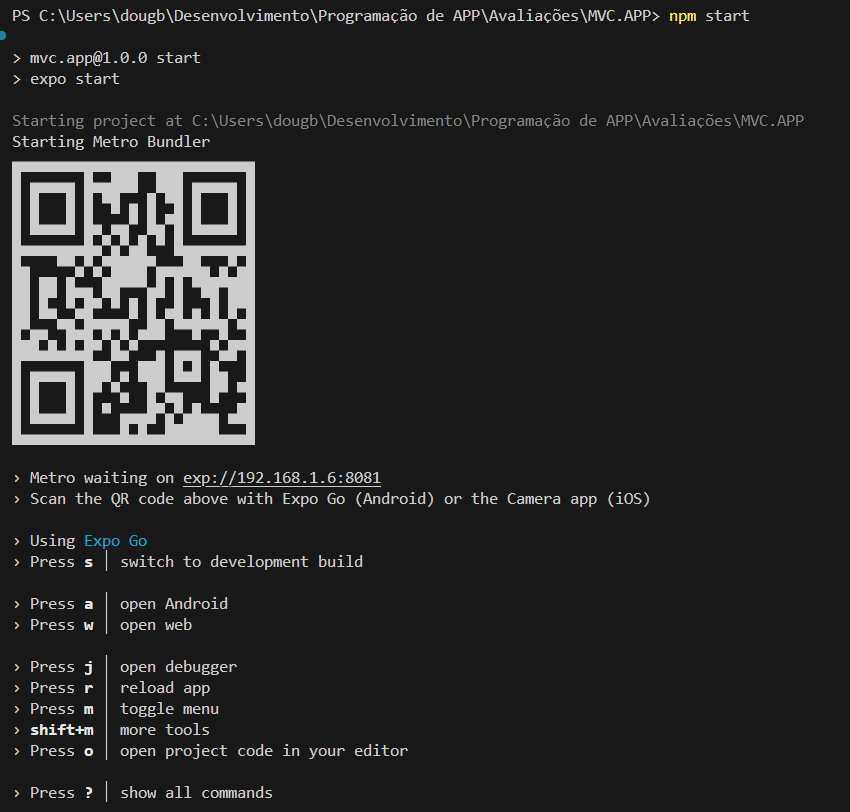

# Calculadora de IMC


Aplicativo feito em React Native que permite realizar o cálculo do **Índice de Massa Corporal (IMC)**.


## Instruções de instalação

### Pré-requisitos
- Node 22+ instalado: [https://nodejs.org/en/download](https://nodejs.org/en/download)
- Android Studio instalado: [https://developer.android.com/studio?hl=pt-br&_gl=1*nl129j*_up*MQ..&gclid=Cj0KCQjwlYHBBhD9ARIsALRu09rxNPq228HpyHa7VIYhfOPEGxQ4mMm83XcsO_7C9YKHm55AMZW5zBAaAuEOEALw_wcB&gclsrc=aw.ds](https://developer.android.com/studio?hl=pt-br&_gl=1*nl129j*_up*MQ..&gclid=Cj0KCQjwlYHBBhD9ARIsALRu09rxNPq228HpyHa7VIYhfOPEGxQ4mMm83XcsO_7C9YKHm55AMZW5zBAaAuEOEALw_wcB&gclsrc=aw.ds)
- Expo Go instalado (opcional)

### Passos

1. Clone o repositório
```
git clone https://github.com/douglaslima-pro/imc-app
```

2. Instale as dependências do projeto
```
npm install
```

3. Execute o projeto
```
npm start
```

4. Abra a emulação no Android Studio

5. Ou escaneie o QR Code gerado pelo Expo no aplicativo **Expo Go**



> [!NOTE]
> Os comandos devem ser executados na pasta raiz do projeto!

## Funcionalidades
1. Calcular IMC:
    - Permite inserir os valores de peso (em quilos) e altura (em metros)
    - Possui um botão para calcular o IMC
    - Valida os dados inseridos e exibe uma mensagem de erro caso os dados sejam inválidos
    - Exibe o resultado do cálculo para o usuário

## Contribuição
Contribuições são bem-vindas! Se você tiver qualquer correção ou sugestões de melhorias, por favor, abra uma issue ou envie um pedido de pull request no repositório.

Ao contribuir com este projeto, por favor, mantenha o estilo de escrita dos códigos e envie as mudanças em um branch separado.
